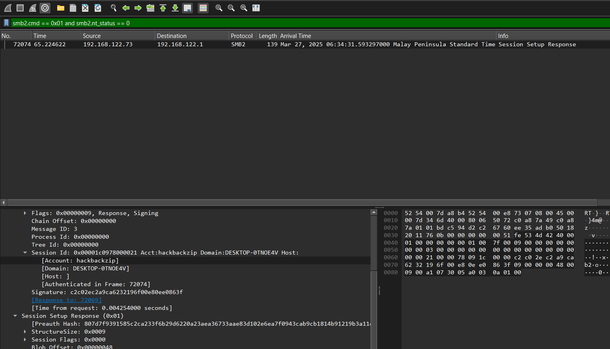

# swampCTF 2025


I was invited by my friend to join swampCTF 2025 this weekend. I immediately accpet the inviation just because the logo is soooooo CUTEEEE! >3<

## Forensic
 ### MuddyWater (200 pts)
 >We caught a threat actor, called MuddyWater, bruteforcing a login for our Domain Controller. We have a packet capture of the intrustion. Can you figure out which account they logged in to and what the password is?
 Flag format is swampCTF{username:password}

 

Apply the filter ```smb2.cmd == 0x01 and smb2.nt_status == 0``` to find Session Setup Requests/Responses in SMBv2 and responses where NT Status is SUCCESS (0x00000000). From there it will reveal the account username which have successfully logged on - `username: hackbackzip`, `domain:DESKTOP-0TNOE4V`


After I followed the stream, i found out that it used NTLM Security Support Provider (NTLMSSP) for the authentication and it can be cracked by collecting the NTLM authentication handshakes and turn them into password hashes.


For this challenge, there is a tutorial [video](https://youtu.be/lhhlgoMjM7o) on Youtube that shows how to assemble the password hash for NTLM in wireshark. Basically the hash is made up of 5 components:

1. User
2. Domain
3. Server Challenge
4. NTProofStr
5. NTLMv2Response (without NTProofStr)

and each of them can be obtained from the captured network traffic.


In the traffic stream find the NTLMSSP_Challenge. `Server Challenge: d102444d56e078f4`


Look for packet with NTLMSSP_AUTH to obtain the NTProofStr and NTLMv2 Response. 

`NTProofStr: eb1b0afc1eef819c1dccd514c9623201`,

`NTLMv2 Response(without NTProofStr):01010000000000006f233d3d9f9edb01755959535466696d0000000002001e004400450053004b0054004f0050002d00300054004e004f0045003400560001001e004400450053004b0054004f0050002d00300054004e004f0045003400560004001e004400450053004b0054004f0050002d00300054004e004f0045003400560003001e004400450053004b0054004f0050002d00300054004e004f00450034005600070008006f233d3d9f9edb010900280063006900660073002f004400450053004b0054004f0050002d00300054004e004f004500340056000000000000000000`

So the final hash value will be:

```hackbackzip::DESKTOP-0TNOE4V:d102444d56e078f4:eb1b0afc1eef819c1dccd514c9623201:01010000000000006f233d3d9f9edb01755959535466696d0000000002001e004400450053004b0054004f0050002d00300054004e004f0045003400560001001e004400450053004b0054004f0050002d00300054004e004f0045003400560004001e004400450053004b0054004f0050002d00300054004e004f0045003400560003001e004400450053004b0054004f0050002d00300054004e004f00450034005600070008006f233d3d9f9edb010900280063006900660073002f004400450053004b0054004f0050002d00300054004e004f004500340056000000000000000000```


Crack the hash using hashcat and the password found. `password: pikeplace`

Final flag: `swampCTF{hackbackzip:pikeplace}`

#

### Proto Proto (214 pts)
>Moto Moto likes you. But not enough to explain how his server works. We got a pcap of the client and server communicating. Can you figure out how the server works and retrieve the flag? chals.swampctf.com:44254


### Homework Help (50 pts)
 >I accidently lost some of my class notes! Can you help me recover it? (Note: Unzipped size is 4GB)

 

 Open the downloaded image file in the FTK imager. Since the question mentioned about class notes. Navigate to **\school\Hacking**, there are a few deleted notes in it, export the '**Hacking Notes.docx**'. 

 

 Once exported open the docx file, and the flag found.

 `swampCTF{n0thing_i5_3v3r_d3l3t3d}`

 #

 ### Preferential Treatment (150 pts)
  >We have an old Windows Server 2008 instance that we lost the password for. Can you see if you can find one in this packet capture?


From the downloaded .pcap file. Follow the TCP stream for any packets. From the stream there is a cpassword, which is used for setting passwords from the Group Policy Preferences (GPP) and this can be easily decrypte using the gpp-decrypt tool.


Copy the cpassword and decrypt it using gpp-decrypt and the flag found.

`swampCTF{4v3r463_w1nd0w5_53cur17y}`

#

 ### Planetary Storage (200 pts)
 >My friend found this strange file while perusing his computer, but we can't read it. Can you figure out what it is and get the information from it?


Check each of the .ldb file content and their payload. The file 000010.ldb payload have the flag. 


Decode the payload in cyberchef from Base64.


Decode the payload value with Base64 again and the flag found.

`swampCTF{1pf5-b453d-d474b453}`


